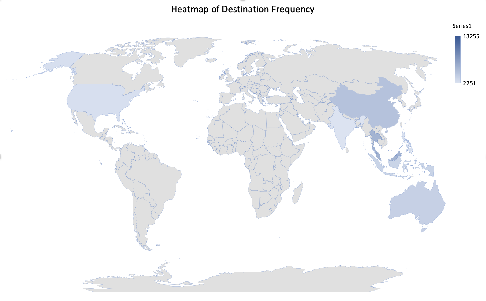

```{r setup, include=FALSE}
knitr::opts_chunk$set(message = FALSE,echo = FALSE)
pacman::p_load(knitr,tidyverse, png, grid,reshape2,ggplot2, dplyr, tidyr,scales,ggpubr,magrittr,polycor,mnormt,readxl,kableExtra,corrplot,MASS,arm)
```

```{r import data, echo=TRUE}
ins <-read.csv("~/Desktop/travel insurance.csv")
str(ins)
#summary(ins$Destination)
des <- table(ins$Destination)
#view(des)
des <- as.data.frame(des)
quantile(des$Freq)
des$Freq <- ifelse(des$Freq > 2200, des$Freq, "other")
desa <-des[!(des$Freq == "other"),]
des <- desa
names(des) <- c("region", "freq")
```
need to exclude the items with duratio "-", age > 114. 
```{r,echo=TRUE}
knitr::kable(ins %>%
filter(grepl("-",Duration)))
ins <- ins%>%
filter(!grepl("-",Duration) & !grepl("118",Age))
ins%>%
filter(grepl("-",Duration)| Age == "118")
```


```{r,echo=TRUE}

FY = length(which(ins$Claim == "Yes" & ins$Gender =="F"))
FN = length(which(ins$Claim == "No" & ins$Gender =="F"))
MY = length(which(ins$Claim == "Yes" & ins$Gender =="M"))
MN = length(which(ins$Claim == "No" & ins$Gender =="M"))
UY = length(which(ins$Claim == "Yes" & ins$Gender ==""))
UN = length(which(ins$Claim == "No" & ins$Gender ==""))
sex <- data.frame(Claim = rep(c("Yes","No"), each = 3),
                  Gender = rep(c("Female","Male","NA"),2),
                  claim_count = c(FY,MY,UY,FN,MN,UN))

ggplot(data = sex, aes(x= Gender, y = claim_count, fill = Claim)) +
  geom_bar(stat = "identity")
datpie <- data.frame(
  group = c("F","M","NA"),
  value = c(FY,MY,UY)
)
ggplot(datpie, aes(x="", y= value, fill = group))+
  geom_bar(stat = "identity", width = 1, color = "white")+
  coord_polar("y", start = 0)+
  theme_void()+
  labs(title="claims distribution with respect to gender information")

#As shown in graphs, some people without gender information made claims. we may not use the column gender

```


 


```{r,echo=TRUE}
ins1 <- ins %>% filter(ins$Destination == "SINGAPORE")
Singapore <- length(which(ins1$Claim == "Yes"))/length(ins1$Claim)
ins2 <- ins %>% filter(ins$Destination == "CHINA")
China <- length(which(ins2$Claim == "Yes"))/length(ins2$Claim)
ins3 <- ins %>% filter(ins$Destination == "AUSTRALIA")
Australia <- length(which(ins3$Claim == "Yes"))/length(ins3$Claim)
ins4 <- ins %>% filter(ins$Destination == "INDONESIA")
Indonesia <- length(which(ins4$Claim == "Yes"))/length(ins4$Claim)
ins5 <- ins %>% filter(ins$Destination == "HONG KONG")
HK<-   length(which(ins5$Claim == "Yes"))/length(ins5$Claim)
ins6 <- ins %>% filter(ins$Destination == "MALAYSIA")
Malaysia <- length(which(ins6$Claim == "Yes"))/length(ins6$Claim)
ins7 <- ins %>% filter(ins$Destination == "INDIA")
India <- length(which(ins7$Claim == "Yes"))/length(ins7$Claim)
ins8 <- ins %>% filter(ins$Destination == "UNITED STATES")
US <- length(which(ins8$Claim == "Yes"))/length(ins8$Claim)
ins9 <- ins %>% filter(ins$Destination == "THAILAND")
Thailand <- length(which(ins9$Claim == "Yes"))/length(ins9$Claim)
ins10 <- ins %>% filter(ins$Destination == "PHILIPPINES")
Philippines <- length(which(ins10$Claim =="Yes"))/length(ins10$Claim)
region <- c("Singapore","China","Australia","Indonesia","HK","Malaysia","India","US","Thailand","Philippines")
ratio <- c(Singapore,China,Australia,Indonesia,HK,Malaysia,India,US,Thailand,Philippines)
dest <- data.frame(region,ratio)
ggplot(dest,aes(x = reorder(region,ratio),y = ratio,fill = region))+
  geom_bar(stat = "identity")+
  xlab("Countries")+
  ylab("Claim Rate")+
  scale_y_continuous(labels = scales::percent)+
  coord_flip()+
  theme_gray()+
  labs(title = "probability of having a claim for each destination country")+
  theme(legend.position="none")
```

# the graph to check the distribution of travelers age and their claim distribution.
```{r,echo=TRUE}
newins <- ins %>% dplyr::select(Destination,Claim,Duration,Age) %>% filter(Destination %in% c("AUSTRALIA","CHINA","HONG KONG","UNITED STATES","MALAYSIA","THAILAND","INDIA","PHILIPPINES","INDONESIA","SINGAPORE"))
newins$Destination <- as.factor(newins$Destination)

str(newins)
ggplot(data = newins, aes(newins$Age, fill = Claim))+
  geom_histogram()+labs(title="Histogram for Age", x="Age", y="Count")+
  scale_fill_manual(values = c("lightblue", "steelblue"), guide = FALSE)
```
# the graphs to observe the duration matters for each destination.
```{r,echo=TRUE}

newins$Claim <- as.factor(newins$Claim)
qnt <- quantile(newins$Duration,seq(0,1,.25))
newins$duration <- cut(newins$Duration,unique(qnt),include.lowest=TRUE)
theme_set(theme_bw())
b<- ggplot(data = newins, aes(x= duration, y = Claim, fill = Claim )) + geom_bar(stat = "identity")+scale_fill_brewer(palette="Greens")+theme(axis.text.x = element_text(angle=45, hjust =1))
b +  facet_wrap(~ newins$Destination)+xlab("quantile for duration") + ylab("claim count")

c <- ggplot(data = newins)+ geom_bar(mapping = aes(x = duration, fill = Claim), position ="fill")+scale_fill_brewer(palette="Oranges")
c + facet_wrap(~ newins$Destination)+coord_cartesian( ylim = c(0, 0.08))+ theme(axis.text.x = element_text(angle=45, hjust =1))

```


# so far, we have gender, age, duration, destination. 

need to check the product 
```{r,echo=TRUE}
newins2 <- ins %>% dplyr::filter(Destination %in% c("AUSTRALIA","CHINA","HONG KONG","UNITED STATES","MALAYSIA","THAILAND","INDIA","PHILIPPINES","INDONESIA","SINGAPORE")) 
newins3 <- newins2
newins2$Claim = ifelse(newins2$Claim =="Yes",1,0)
newins3$Claim = ifelse(newins3$Claim =="Yes",1,0)

newins3 <- newins2 %>% dplyr::filter(Claim ==1) %>% dplyr::select(Product.Name,Destination)
library(plyr)
d =ddply(newins3,.(Product.Name,Destination),nrow)
colnames(d) <- c("Product.Name","Destination","claimcount")
quantile(d$claimcount)
ggplot(data = d, mapping = aes(x = Destination, y = Product.Name, fill = claimcount))+ geom_tile()+ scale_fill_gradient2()+theme(panel.background = element_rect(fill = "cornsilk"))+
theme(axis.text.x = element_text(angle=45, hjust =1))
```


```{r,echo=TRUE}
library(corrplot)
cor <-newins2 %>% dplyr::select(Claim,Duration,Net.Sales,Commision..in.value.,Age)
#corrplot(cor,method = "circle",type = "upper",diag = F)
```

```{r,echo=TRUE}
newins2$Agency.Type <- as.factor(newins2$Agency.Type)
newins2$Distribution.Channel<-as.factor(newins2$Distribution.Channel)
newins2$Destination<-as.factor(newins$Destination)
newins2$Gender=as.character(newins2$Gender)
newins2 %<>% mutate(gender=ifelse((Gender)=="", "Unknown", Gender))
newins2$gender <- as.factor(newins2$gender)
newins2$Product.Name <- as.factor(newins2$Product.Name)
newins2$Duration <- as.numeric(newins2$Duration)
newins2$Age <-as.numeric(newins2$Age)
```


```{r,echo=TRUE}
md0 <- glm(Claim ~ Agency.Type+Distribution.Channel+Destination+Gender+Product.Name+ Duration + Age+Net.Sales+Commision..in.value., data = newins2, family=binomial(link="logit"))
display(md0)
```

```{r,echo=TRUE}
step = stepAIC(md0,direction = "both",trace = 0)
step$anova
```

From the summary of md0, we see that the variables of statistical significance includes:
Agency.Type, Destination, Product.Name,Age and Net.Sales.

From the stepAIC function, the model selects Agency.Type, Destination, Product.Name,Age and Net.Sales and 
Commision..in.value as predictors.

From the correlation plot, we see that the variable(Net.Sales) and Variable(commision..in.value) are strongly correlated.
We may remove the predictor(commision..in.value) later.

```{r,echo=TRUE}
md1 <- glm(Claim ~ Agency.Type+Product.Name + Age+Net.Sales+Commision..in.value., data = newins2, family=binomial(link="logit"))
md2 <- glm(Claim ~ Agency.Type+Product.Name+ Age+ Net.Sales, data = newins2, family=binomial(link="logit"))
summary(md1)
summary(md2)
library(arm)
library(alr3)
binnedplot(predict(md1),resid(md1,type = "response"))
marginalModelPlots(md1)
binnedplot(predict(md2),resid(md2,type = "response"))
```

From the summary and binnedplot of md1 and md2, there's not an obvious difference between md1 and md2.
In this case, we could choose md2 without predictor(commision..in.value.).
md2 is the model that are complete pooling.

```{r,echo=TRUE}
md3<- glm(Claim ~ Agency.Type+Product.Name+ Age+ Net.Sales + factor(Destination), data = newins2, family=binomial(link="logit"))
summary(md3)
binnedplot(predict(md3),resid(md3,type = "response"))
```


md3 is the model with no pooling.

md4 will be partial pooling.
```{r,echo=TRUE}
library(lme4)
library(car)
md4 <- glmer(Claim ~ Agency.Type+Product.Name+ Age+ Net.Sales +(1|Destination), data = newins2, family=binomial)
summary(md4)
print(md4, correlation=TRUE)
binnedplot(predict(md4),resid(md4, type = "response"))
library(RLRsim)
exactRLRT(md4)
```


```{r,echo=TRUE}
q2 <- quantile(newins2$Duration,seq(0,1,.25))
newins2$duration <- cut(newins2$Duration,unique(q2),include.lowest=TRUE)
md5 <- glmer(Claim ~ Agency.Type+Product.Name+ Age+ Net.Sales +Destination+(1|Duration), data = newins2, family=binomial)
summary(md5)
binnedplot(predict(md5),resid(md5, type = "response"))
```

```{r,echo=TRUE}
md4.predict <- predict(md4, newins2,type="response")
md4.predict <- ifelse(md4.predict > 0.05,1,0)
md4.predict <- as.factor(md4.predict)
#head(md4.predict)
newins2$claim <- as.factor(newins2$Claim)
compare <- cbind(obs = newins2$claim, pred = md4.predict)
library(caret)
confusionMatrix(md4.predict, newins2$claim)
library(pROC)
rocCurve <- roc(response = newins2$claim, predictor = as.numeric(md4.predict), levels = rev(levels(newins2$claim)))
plot(rocCurve, legacy.axes = TRUE,print.auc=TRUE, auc.polygon=TRUE, 
     grid=c(0.1, 0.2),grid.col=c("green", "red"), max.auc.polygon=TRUE,
     auc.polygon.col="orange", print.thres=TRUE,main=" ROC Curve Plot of Logistic md4 with threshold = 0.05")

md4.predict <- predict(md4, newins2,type="response")
md4.predict <- ifelse(md4.predict > 0.5,1,0)
md4.predict <- as.factor(md4.predict)
#head(md4.predict)
newins2$claim <- as.factor(newins2$Claim)
compare <- cbind(obs = newins2$claim, pred = md4.predict)
library(caret)
confusionMatrix(md4.predict, newins2$claim)
library(pROC)
rocCurve <- roc(response = newins2$claim, predictor = as.numeric(md4.predict), levels = rev(levels(newins2$claim)))
plot(rocCurve, legacy.axes = TRUE,print.auc=TRUE, auc.polygon=TRUE, 
     grid=c(0.1, 0.2),grid.col=c("green", "red"), max.auc.polygon=TRUE,
     auc.polygon.col="orange", print.thres=TRUE,main=" ROC Curve Plot of Logistic md4 with threshold = 0.5")

```
```{r,echo=TRUE}
lattice::dotplot(ranef(md4, condVar=TRUE))
```

```{r,echo=TRUE}
anova(md5,md2,md3,md4)
AIC(md2,md3,md4,md5)
```
```{r}
pred = predict(md4,type = "link")

red = as.numeric(as.character(pred))- as.numeric((as.character(newins2$Claim)))

com = data.frame(obs = newins2$Claim,pre = pred) %>% pivot_longer(cols = 1:2,names_to = "type",values_to = "value")
redd = sample(red,4000)
car::qqPlot(redd)

ggplot(com) + geom_density(aes(x = value,fill = type),alpha = 0.3)

pred = predict(md2,type = "link")

red = as.numeric(as.character(pred))- as.numeric((as.character(newins2$Claim)))

com = data.frame(obs = newins2$Claim,pre = pred) %>% pivot_longer(cols = 1:2,names_to = "type",values_to = "value")
redd = sample(red,4000)
car::qqPlot(redd)

ggplot(com) + geom_density(aes(x = value,fill = type),alpha = 0.3)

pred = predict(md5,type = "link")

red = as.numeric(as.character(pred))- as.numeric((as.character(newins2$Claim)))

com = data.frame(obs = newins2$Claim,pre = pred) %>% pivot_longer(cols = 1:2,names_to = "type",values_to = "value")
redd = sample(red,4000)
car::qqPlot(redd)

ggplot(com) + geom_density(aes(x = value,fill = type),alpha = 0.3)

pred = predict(md3,type = "link")

red = as.numeric(as.character(pred))- as.numeric((as.character(newins2$Claim)))

com = data.frame(obs = newins2$Claim,pre = pred) %>% pivot_longer(cols = 1:2,names_to = "type",values_to = "value")
redd = sample(red,4000)
car::qqPlot(redd)

ggplot(com) + geom_density(aes(x = value,fill = type),alpha = 0.3)


```

```{r}
mda <- glm(as.numeric(as.character(Claim)) ~ Age, data = newins2, family = binomial )
mdb <- glm(as.numeric(as.character(Claim)) ~ Net.Sales, data = newins2, family = binomial )
mdc <- glm(as.numeric(as.character(Claim)) ~ Commision..in.value., data = newins2, family = binomial )


ggplot(newins2) + geom_jitter(aes(y = Claim,x = Age),color = "blue",alpha = 0.1) + facet_wrap(~ Destination)+labs(title = "Claim ~ Age, group by destination")
ggplot(newins2) + geom_jitter(aes(y = Claim,x = Net.Sales),color = "green",alpha = 0.1) + facet_wrap(~ Destination)+labs(title = "claim ~ Net.Sales, group by destination")
ggplot(newins2) + geom_jitter(aes(y = Claim,x = Commision..in.value.),color = "orange",alpha = 0.1) + facet_wrap(~ Destination)+labs(title = "Claim ~ Commision..in.value, group by destination")


```


